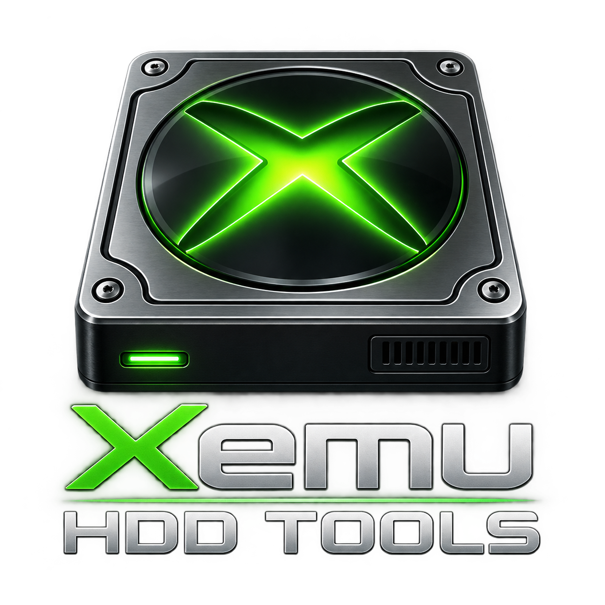

<p align="center">
  
</p>
<p align="center">
  <a href="https://github.com/SkillerCMP/CMP-XEMU-HDD-TOOL/releases">
    
  </a>
  <a href="https://github.com/SkillerCMP/CMP-XEMU-HDD-TOOL/releases/latest">
    

# Xemu HDD Tools 0.6b — Help

**Xemu HDD Tools** is a standalone toolkit for working with original-Xbox HDD data used by Xemu. It includes a native Windows graphical application and a command-line converter.

The program is designed around one safety rule: **the selected source is treated as the original and write operations publish a NEW output instead of overwriting it in place.**

## Included programs

| Program | Purpose |
|---|---|
| `Xemu-HDD-Tools.exe` | Windows GUI with HDD Converter, Custom Soundtrack Builder, and HDD Directory tools. |
| `xemu-hdd-convert.exe` | Command-line converter/analyzer for HDD conversion and verification workflows. |

The GUI and CLI share the same FATX/conversion backend.

## Supported HDD formats

Xemu HDD Tools supports:

- standalone **QCOW2** Xbox HDD images;
- standard **RAW** Xbox HDD images;
- synchronized **Folder-HDD** layouts using the standard C/E images and mirrors;
- standard Xbox **C, E, X, Y, and Z** partitions.

The program does not claim support for F/G custom partition layouts, encrypted images, QCOW2 backing chains, live HDD access, source repair, or emulator save-state migration.

## Required helper files

The program can use two external helper executables from the `tools` folder beside the program.

### `tools\qemu-img.exe`

`qemu-img.exe` is used when Xemu HDD Tools needs to read or create **QCOW2** images.

It is needed for operations such as:

- QCOW2 -> Folder-HDD;
- Folder-HDD -> QCOW2;
- QCOW2 -> clean QCOW2/RAW output;
- QCOW2 verification/inspection paths that require decoding the image.

RAW and Folder-HDD operations that do not involve QCOW2 do not require qemu-img.

The Windows Docker build packages the pinned qemu-img helper and the DLLs it requires into the output `tools` folder.

### `tools\ffmpeg.exe`

`ffmpeg.exe` is used only by the **Custom Soundtrack Builder** when newly imported audio must be converted to the Xbox-compatible soundtrack format.

FFmpeg is needed when:

- adding new audio that is not already in the required compatible format;
- converting imported audio to the soundtrack WMA profile used by the original Xbox dashboard format.

FFmpeg is **not** required for:

- HDD Converter operations;
- HDD Directory browsing/editing;
- existing compatible soundtrack files that can be preserved without re-encoding.

FFmpeg is not bundled with Xemu HDD Tools. Place a trusted `ffmpeg.exe` at:

```text
tools\ffmpeg.exe
```

or select another path from **Options > Helper locations...**.

## Before using an HDD

Close **Xemu and any other program that can write to the selected HDD source** before refreshing, converting, editing, or saving.

For important data, keep the original HDD source as your primary recovery copy. Xemu HDD Tools also creates operation-specific backups for Custom Soundtrack Builder and HDD Directory edits.

---

# Windows GUI

Launch:

```text
Xemu-HDD-Tools.exe
```

The top of the window contains shared **Source** and **New output** controls. Source and output can be selected independently as QCOW2, Folder-HDD, or RAW.

The main tabs are:

1. **HDD Converter**
2. **Custom Soundtrack Builder**
3. **HDD Directory**

Only one disk operation runs at a time.

## Source and New Output

**Source** is the HDD you want to read.

**New output** is where a conversion or edited result is written. Normal workflows do not silently overwrite the selected source.

Changing the source checks the editor tabs for unsaved work before invalidating their current data.

A successful save does not automatically make the new output the active source. Select the new output as Source if you want to continue working with it.

## Helper locations

Use:

```text
Options > Helper locations...
```

Default paths are:

```text
tools\qemu-img.exe
tools\ffmpeg.exe
```

## Themes

Use **Options > Theme** to select:

- Default (White)
- Dark Mode
- Xbox Mode

The selected theme affects the application workspace and application-owned controls/dialogs. Windows High Contrast takes priority when enabled.

---

# HDD Converter

The HDD Converter creates a clean current-file reconstruction rather than a sector-for-sector forensic clone.

## Convert

Use Convert to create a new HDD in another supported format.

Typical workflows include:

- QCOW2/RAW image -> Folder-HDD;
- Folder-HDD -> QCOW2/RAW image;
- QCOW2/RAW image -> clean QCOW2/RAW image.

The clean rebuild preserves current live filesystem content while excluding storage that is not part of the current filesystem, such as deleted directory entries, free-cluster contents, stale bytes after logical file ends, and stale directory padding/slack.

## Verify

Use **Verify** to inspect and validate the selected source without creating a new output.

---

# Custom Soundtrack Builder

The Custom Soundtrack Builder manages original-Xbox custom soundtracks stored in the HDD music database and soundtrack folders.

You can:

- refresh the HDD soundtrack database;
- create a soundtrack;
- rename a soundtrack;
- add new audio;
- rename song entries;
- delete song entries;
- reorder songs using drag/drop or move commands;
- save the edited soundtrack data to a new HDD output.

New audio that requires conversion uses `tools\ffmpeg.exe` or the FFmpeg path selected under Helper Locations.

Existing compatible WMA data can remain byte-identical when no conversion is required.

Each save creates a dedicated host backup under the output parent:

```text
Backups\CSB-<unique>\
```

The Custom Soundtrack Builder is soundtrack-aware. Editing soundtrack files directly from HDD Directory does not automatically update `ST.DB`.

---

# HDD Directory

HDD Directory is an offline FATX file manager for the standard Xbox HDD partitions:

- `C: System`
- `E: Data`
- `X: Cache`
- `Y: Cache`
- `Z: Cache`

Available operations include:

- browsing folders;
- recursive filtering;
- file properties and SHA-256 inspection;
- copying a FATX path;
- exporting files/folders;
- importing files/folders;
- creating folders;
- renaming;
- explicit file replacement;
- copy/move within a partition;
- pending deletion;
- saving edits to a new HDD output.

Cross-partition copies should be performed using Export + Import.

Each HDD Directory save creates a backup under:

```text
Backups\HDD-<unique>\
```

Failed or uncertain operations retain recovery data and report its location instead of silently deleting it.

---

# Command-line converter

The command-line program is:

```text
xemu-hdd-convert.exe
```

Built-in help:

```text
xemu-hdd-convert.exe --help
```

Version:

```text
xemu-hdd-convert.exe --version
```

The CLI provides conversion and analyze operations. Custom Soundtrack Builder and HDD Directory editing remain GUI functions.

## Offline confirmation

Every CLI disk command requires:

```text
--offline
```

This confirms that Xemu and all other writers using the source are closed.

## image-to-folder

```text
xemu-hdd-convert.exe image-to-folder ^
  --source "D:\Xbox\xbox_hdd.qcow2" ^
  --output "D:\Xbox\Xemu-HDD-Folder" ^
  --offline
```

## folder-to-image

QCOW2 output:

```text
xemu-hdd-convert.exe folder-to-image ^
  --source "D:\Xbox\Xemu-HDD-Folder" ^
  --output "D:\Xbox\xbox_hdd_new.qcow2" ^
  --offline
```

RAW output:

```text
xemu-hdd-convert.exe folder-to-image ^
  --source "D:\Xbox\Xemu-HDD-Folder" ^
  --output "D:\Xbox\xbox_hdd_new.img" ^
  --raw-output ^
  --offline
```

## clean-image

```text
xemu-hdd-convert.exe clean-image ^
  --source "D:\Xbox\xbox_hdd.qcow2" ^
  --output "D:\Xbox\xbox_hdd_clean.qcow2" ^
  --offline
```

Use `--raw-output` to create RAW output instead of QCOW2.

## analyze

```text
xemu-hdd-convert.exe analyze ^
  --source "D:\Xbox\xbox_hdd.qcow2" ^
  --offline
```

## CLI options

| Option | Meaning |
|---|---|
| `--source PATH` | Source QCOW2, RAW image, or Folder-HDD. |
| `--output PATH` | New output path for commands that create an output. |
| `--qemu-img PATH` | Use a specific trusted qemu-img executable. |
| `--raw-output` | Produce RAW instead of QCOW2 for image destinations. |
| `--drop-snapshots` | Acknowledge that only current disk files are exported and emulator snapshot history is not migrated. |
| `--offline` | Required confirmation that Xemu and all other source writers are closed. |

The CLI exits with code `0` on success and code `1` when an operation reports an error.

---

# Recovery and source protection

Xemu HDD Tools favors recoverability over automatic cleanup.

- Normal workflows do not silently overwrite the selected source.
- CSB and HDD Directory writes publish a new output.
- Uncertain transaction workspaces are retained and reported.
- Existing recovery/cache files inside the live filesystem are not automatically treated as disposable.
- Snapshot history is not silently migrated or discarded; current-files-only export requires explicit acknowledgement when snapshots are detected.

For build/install instructions, see `Install_Info.md`.

<p align="center">
  
</p>

